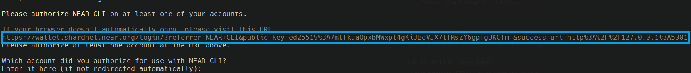
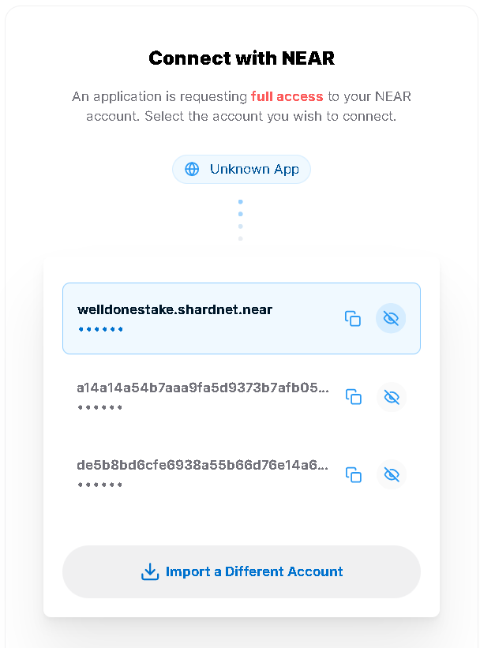

- choose server
  ```
  minimal requirements are 4 cpu, 8GB ram, 500GB ssd
  ```
  for stakewars one could go with VPS but we highly recommend bare_metal/dedicated server in prod environment \
  price vary between 40 - 60 usd for such setup \
  some examples VPS [DigitalOcean](https://www.digitalocean.com/pricing/calculator?cart=basicDropletRegularXXXS), BareMetal [Hetzner AX41-    NVME](https://www.hetzner.com/dedicated-rootserver/ax41-nvme/), [Mevspace](https://mevspace.com/dedicated/configure/93)
   
  check server is capable to run a node

  ```
  lscpu | grep -P '(?=.*avx )(?=.*sse4.2 )(?=.*cx16 )(?=.*popcnt )' > /dev/null \
    && echo "Supported" \
    || echo "Not supported"
  ```
  update OS packages
  ```
  sudo apt update && sudo apt upgrade -y
  ```
  install node.js and other references
  ```
  sudo apt install -y git binutils-dev libcurl4-openssl-dev zlib1g-dev libdw-dev libiberty-dev cmake gcc g++ python docker.io protobuf-compiler libssl-dev pkg-config llvm cargo
  sudo apt install clang build-essential make
  sudo apt install curl jq
  curl -sL https://deb.nodesource.com/setup_18.x | sudo -E bash -  
  sudo apt install nodejs
  PATH="$PATH"
  ```
  validate versions
  `node -v` should display #v18.x.x or higher and `npm -v` should show #8.x.x or higher

- install NEAR
  ```
  sudo npm install -g near-cli, 
  ```
  install Rust
  ```
  sudo apt install curl build-essential gcc make -y and `curl --proto '=https' --tlsv1.2 -sSf https://sh.rustup.rs | sh` (Proceed with installation (default))
  ```
- create a [wallet]( https://wallet.shardnet.near.org/)
- spin-up a node
  ```
  git clone https://github.com/near/nearcore
  cd nearcore
  git fetch
  git checkout 1897d5144a7068e4c0d5764d8c9180563db2fe43
  ```
  `cargo build -p neard --release --features shardnet` \
  `./target/release/neard --home /.near init --chain-id shardnet --download-genesis`
  ```
  rm /.near/config.json
  wget -O /.near/config.json https://s3-us-west-1.amazonaws.com/build.nearprotocol.com/nearcore-deploy/shardnet/config.json  
  ```
  create linux service/daemon, for that in working directory execute `nano neard.service` and paste there
  ```
  [Unit]
  Description=NEARd Daemon Service

  [Service]
  Type=simple
  User=near
  WorkingDirectory=/home/near/.near
  ExecStart=/home/near/nearcore/target/release/neard --home /home/near/.near run
  Restart=on-failure
  RestartSec=30
  KillSignal=SIGINT
  TimeoutStopSec=45
  KillMode=mixed

  [Install]
  WantedBy=multi-user.target
  ```
  and click `Ctrl+O` and then `Ctrl+X`, then create symbolik link to your service config`ln -s /home/near/neard.service /etc/systemd/system`
  To run a node as a service, execute
  ```
  sudo systemctl daemon-reload
  sudo systemctl enable neard
  sudo systemctl restart neard
  ```
  check logs `journalctl -n 100 -f -u neard` to make sure that the node is up and running,
  some time later (~30min) check synchronization status using `curl -s http://127.0.0.1:3030/status | jq .sync_info`, the output should be something like
  ```
    "syncing": false,
    "earliest_block_hash": "3NfyvCAuDo4h9nQF7koj7Uh5nHKesg7U5AogWHjFRV7B",
    "earliest_block_height": 2864260,
    "earliest_block_time": "2022-08-30T18:46:25.049180881Z",
    "epoch_id": "E8H2sXbcv61gg2bJ213avYtWDmsU6EUFHBcwDQnARCXr",
    "epoch_start_height": 3098994
  ```
- deploy new staking pool. \
  staking pool is a smart contract that is deployed to a NEAR account
  
  execute in terminal `near login`, \
   \
  copy provided link and paste it into browser \
   \
  grant Access to Near CLI 
  
  error `This site cannot be reached` is expected \
  provide your wallet and press Enter \
  `Logged in as [xxx.near] with public key [ yyy:zzz] successfully`
  
  next, `near generate-key [pool_id]`, pool_id ---> xx.factory.shardnet.near WHERE xx is you pool name \
  copy the file generated to shardnet folder: make sure to replace <pool_id> by your pool name \
  `cp .near-credentials/shardnet/YOUR_WALLET.json .near/validator_key.json`
  
  edit "account_id" => xx.factory.shardnet.near, where xx is your PoolName \
  change private_key to secret_key
  
  restart neard service `sudo systemctl restart neard`

- monitoring
  [wallet](https://wallet.shardnet.near.org/)
  [explorer](https://explorer.shardnet.near.org/)
  
  logs
  ```
  journalctl -n 100 -f -u neard | ccze -A
  ```
  node vrsion
  ```
  sudo apt install curl jq (execute only once)
  curl -s http://127.0.0.1:3030/status | jq .version
  ```
  delegators/stakes
  ```
  near view <your pool>.factory.shardnet.near get_accounts '{"from_index": 0, "limit": 10}' --accountId <accountId>.shardnet.near
  ```
  kicked-out reason
  ```
  curl -s -d '{"jsonrpc": "2.0", "method": "validators", "id": "dontcare", "params": [null]}' -H 'Content-Type: application/json' 127.0.0.1:3030 | jq -c '.result.prev_epoch_kickout[] | select(.account_id | contains ("<POOL_ID>"))' | jq .reason
  ```
  blocks produced/expected
  ```
  curl -r -s -d '{"jsonrpc": "2.0", "method": "validators", "id": "dontcare", "params": [null]}' -H 'Content-Type: application/json' 127.0.0.1:3030 | jq -c '.result.current_validators[] | select(.account_id | contains ("POOL_ID"))'
  ```
 
  

